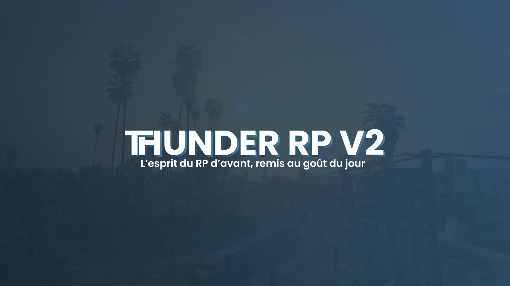
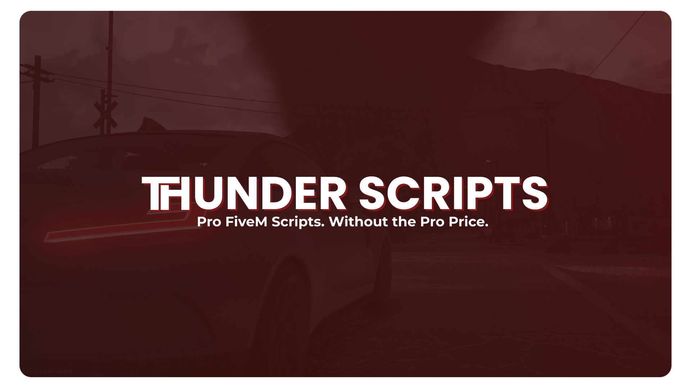
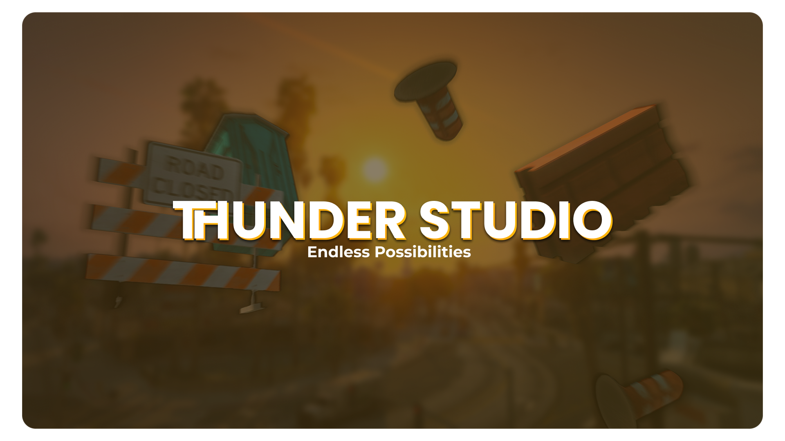

<h1 align="center">👋 Hi, I'm Antoine (Toine)</h1>

  
I'm a Full-Stack Developer, Server Architect, and the Founder of <strong><a href="https://github.com/Thunder-Studio-Org">@Thunder Studio</a></strong>. I specialize in building robust multiplayer infrastructure, premium <strong>FiveM scripts</strong>, and scalable web applications.

  <h3>Full-Stack Web Dev • Server Infrastructure • FiveM/Lua Engineering</h3>

 

  
    

 

<h2 align="center">🛠️ Tech Stack & Tools</h2>

  <!-- Languages -->
  
  
  
  
  
  
    
  
  <!-- Web Tech / Frameworks -->
  
  
  
  
  
  
  
  
    
  
  <!-- Databases & Infrastructure -->
  
  
  
  
  
  
    
  
  <!-- Tools -->
  
  
  
  
  

 

<h2 align="center">⚡ My Projects (Thunder Studio Ecosystem)</h2>

  <h3><a href="https://thunder-rp.fr">🎮 Thunder RP V2</a></h3>
  
A highly customized, persistent GTA V roleplay server built on FiveM. I lead the development of its architecture, gameplay systems, and custom tools.

  

      
  

  
  
    
  
  <h3><a href="https://store.thunder-studio.net">🛒 Thunder Scripts</a></h3>
  
Premium, high-performance FiveM resources designed for scale and reliability. Including tools like <code>ts-persistence</code>, <code>ts-props-system</code>, and <code>ts-lib</code>.

   

      
  

  
  
    

 <h3><a href="https://thunder-studio.net">⚡ Thunder Studio</a></h3>
  
An independent game studio building custom multiplayer servers and tailored infrastructure. We take on commissions and develop community-driven experiences across FiveM, Minecraft, and simulation networks.

  

      
  

  

 

<h2 align="center">📫 Connect With Me</h2>

  
  
  
  

