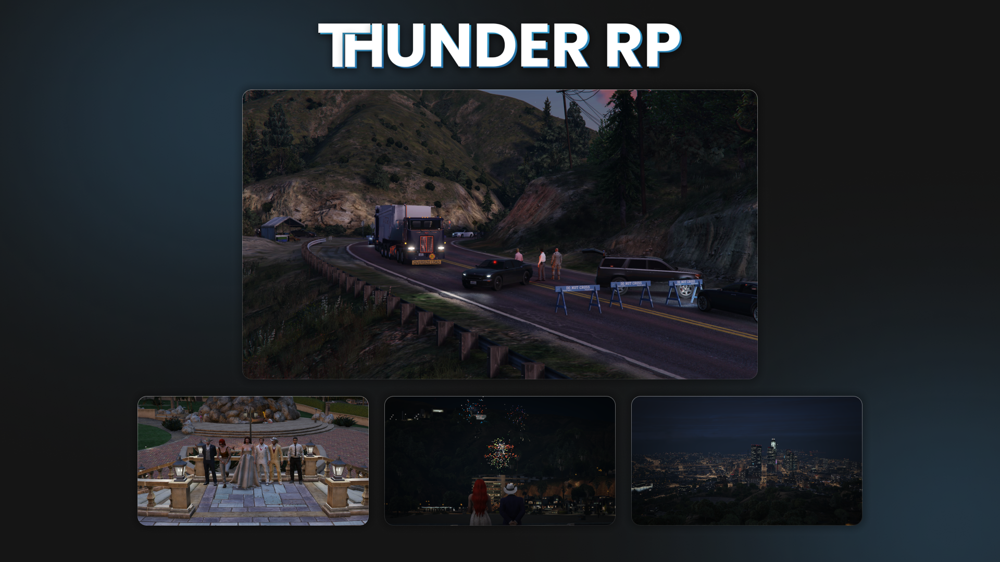
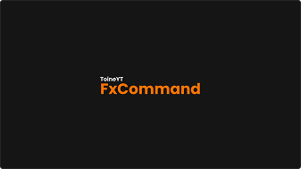

<h1 align="center">👋 Hi, I'm TOINE (ToineYT)</h1>

  
I'm a young passionate <strong>developer</strong>, particularly focused on <strong>FiveM</strong>, where I work on my server <strong>Thunder RP</strong>. Additionally, I work on other <strong>projects</strong> and <strong>video editing</strong>. If you want to know more, check out my <strong>Projects</strong>!

  <h3>Web Dev • Node.js • FiveM Lua • Video Editor</h3>

  

<h2 align="center">Languages & Tools</h2>

  
  
  
  
  
  
  
  
  
  
  
  
  

<h2 align="center">Projects</h2>

  <h3>🎮 Thunder RP</h3>
  
My GTA 5 (FiveM) Roleplay server is entirely developed by me. It focuses on authentic roleplay, without any profit objectives!

  
  
  <h3>🔧 FxCommand</h3>
  
This plugin allows FiveM users to send various commands through Deckboard.

  

<h2 align="center">FiveM Store (Coming Soon)</h2>

  
Explore a variety of FiveM scripts and resources available for your server. Enhance your gameplay with high quality script!

   

<h2 align="center">Follow Me</h2>

  
  
  
  

